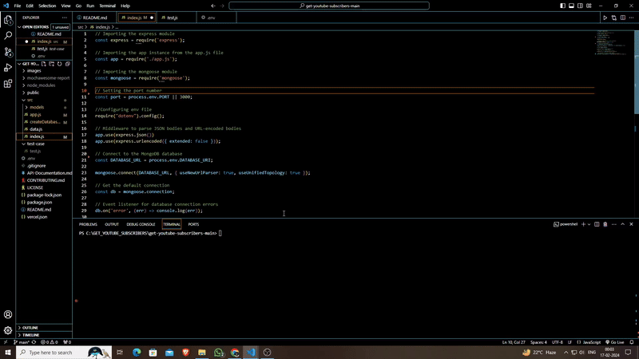

<h1 align="center">GET YOUTUBE SUBSCRIBERS</h1>
<p align="center">Develop a Node.js program to retrieve comprehensive information about YouTube subscribers.</p>


<h2 align="center">
<a href = "https://get-youtube-subscribers-eznt1ftwf-rahul-deys-projects.vercel.app" target="_blank">Preview</a>
</h2>


## Table of Contents

- [Introduction ](#introduction)
- [Tech Stack ](#tech-stack)
- [Features ](#features)
- [Prerequisites ](#prerequisites)
- [Installation & Run](#installation-&-run)
- [API Reference ](#api-reference)
- [Contribute ](#contribute)
- [License ](#license)
- [Acknowledgments ](#acknowledgments)
- [Contact ](#contact)


## Introduction
Introducing Get YouTube Subscribers, an app built with Node.js and Express.js, leveraging MongoDB as its database. This RESTful API fetches comprehensive subscriber information for YouTube channels, offering efficient data management. It's your go-to solution for accessing and managing subscriber data effortlessly.



## Tech Stack
The Get-Youtube-Subscriber app is developed using the following technologies:

- **Node.js:** A tool that runs JavaScript code on the server-side.
- **Express.js:** A framework for creating web applications and APIs using Node.js.
- **MongoDB:** A NoSQL database that stores and manages data in a JSON-like format.

## Features
Some features of this application :
- **Effortless Subscriber Data Retrieval:** Seamlessly retrieve subscriber data from YouTube channels using API endpoints.
- **Well-Organized JSON Output:** Display retrieved data in structured JSON format for straightforward interpretation.
- **Diverse API Endpoints:** Offer users a range of API endpoints to meet different data retrieval requirements.
- **Smooth YouTube Data API Integration:** Seamlessly integrate with the YouTube Data API to ensure precise data retrieval.
- **Simple Setup:** Follow an easy setup process for quick utilization of the tool, making it user-friendly.

## Prerequisites

To use this project on your computer, make sure you've got these installed:

- [Node.js](https://nodejs.org/)
- [MongoDB](https://www.mongodb.com/)

## Installation and Run
1. Clone the repository from GitHub:
    ```
     git clone https://github.com/RahulDey25/get-youtube-subscribers.git
    ```
2. Redirect to the project folder:
    ```
     cd get-youtube-subscribers
    ```
3. Install the required dependencies:
    ```
     npm install
    ```
4. Configure the application:
   - Create a `.env` file in the root directory of the project.
   - Add the following environment variables to the `.env` file:
      ```
       PORT=3000                                  # The port on which the application will run
       DATABASE_URI=<your-uri-connection-string>  # The MongoDB connection string
      ```
5. Create Database:
    - Inserting subscribers data into MongoDB.
        ```
         npm run createDB
        ```
6. Start server:
    ```
     npm start
    ```
    > [!NOTE]
    > Access the  application in your web browser at `http://localhost:3000` (base URL)


## API Reference
Retrieve subscriber information using the GET method with the following API endpoints. You can find more details in the [API Documentation](./API-Documentation.md).

- `/subscribers`: Response with an array of subscribers(an Object) including their id, name, subscribed channel and date.
- `/subscribers/names`: Response with an array of subscribers(an Object with only two fields name and subscribedChannel)
- `/subscribers/id`: Response with a subscriber*(an object)* with given id. Response with status code 400 and Error message({message: error.message}) if id does not match

## Contribute

Feel free to pitch in! Check out our [Contribution Guidelines](CONTRIBUTING.md) for details on how to get involved.

## License
This project is licensed under the ISC License. Check out the [LICENSE](./LICENSE) file for details.

## Acknowledgment
I will be grateful for the open-source community and the minds behind Node.js, Express, and MongoDB. Their contributions are invaluable to us.

I' would also like to extend our thanks to all who've contributed to this project.

## Contact

If you need any help or have ideas, don't hesitate to contact me at[Gmail](https://mail.google.com/mail/u/0/#inbox?compose=GTvVlcSGLPhhCThjSQBxqqKCTksFHbgmPZGmrTXlskrtrXBgHxRqbmdRdzJJlNBtvTWsTLmjdVLbb).


## Happy Learning

<p align="center">
<a href="https://github.com/RahulDey25/get-youtube-subscribers">

    
</a>
</p>

